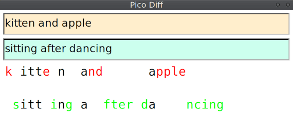

# Pico Diff

Tiny GUI app to compare text easily. Lightweight as feather, handy in palm and has cross-platform support. Written in [Rust](https://www.rust-lang.org/) along with [fltk-rs](https://github.com/fltk-rs/fltk-rs) (Rust's binding for [FLTK](https://www.fltk.org/)).

## Usage

Just run the binary for your platform, either of Windows, MacOS, Linux. The window will start so put text at input fields on the form. The comparison result will appear.

## Acknowledgements

Depends on `Rust` programming language, `FLTK` cross-platform GUI toolkit, `fltk-rs` and [`similar`](https://github.com/mitsuhiko/similar) diffing library.
